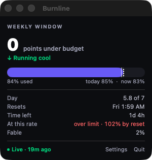
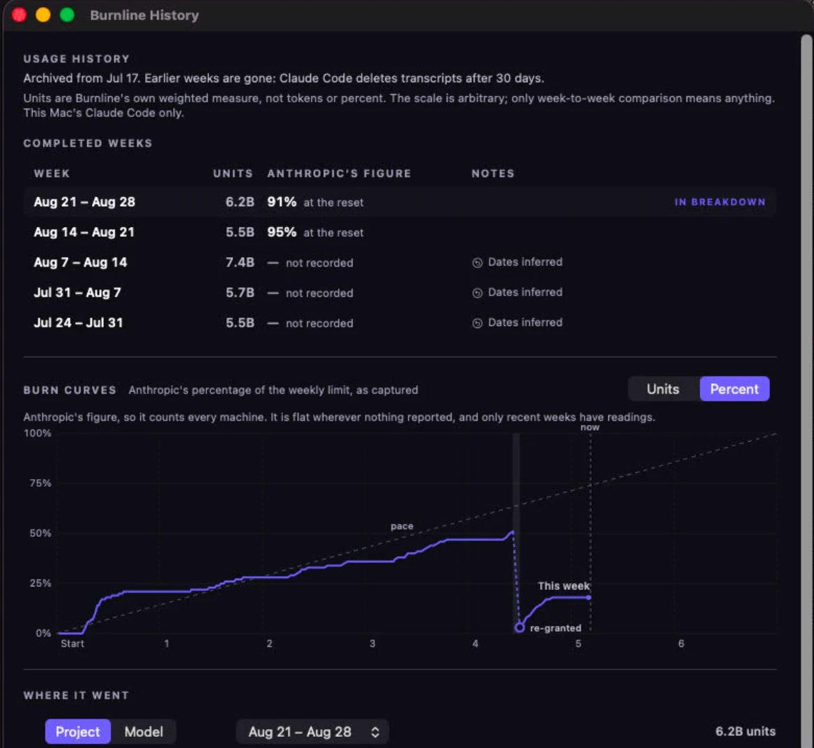

# Burnline

[](https://github.com/Stixum/Burnline/releases/latest)
[](https://github.com/Stixum/Burnline/releases/latest)
[](https://github.com/Stixum/Burnline/releases/latest)
[](LICENSE)

A macOS menu bar app that shows where you *should* be in your Claude weekly usage window, next to where you actually are.

```
64/65
```

64% used, 65% of the week gone. One point ahead of pace.



- **Violet fill** is what you've spent.
- **Solid marker** is where you should be right now.
- **Translucent band** runs out to the end-of-day target. Spend into it and the day finishes level.

## Why

Your weekly limit resets on a fixed day and time. Seven days is 100%, so each day is about 14.3%, and on day 5 you're roughly 71% through.

`/usage` gives you the actual number. Nothing gives you the target to judge it against, and neither is visible without stopping what you're doing.

## Install

> ### ⬇️ [Download the latest release](https://github.com/Stixum/Burnline/releases/latest)
>
> Open `Burnline.dmg`, drag Burnline to Applications, launch it. Signed and notarized, so no right-click-to-open dance.
>
> **Universal binary**, Apple silicon and Intel. macOS 14 or later.

Or with Homebrew:

```bash
brew install --cask stixum/tap/burnline
```

Burnline keeps itself up to date: it checks for new versions and offers them in place. Automatic checking can be turned off in Settings. Updates are signed, and one that fails signature verification is refused. Homebrew installs can keep using `brew upgrade --cask burnline` instead.

## What it reads

Local files. No credentials, no telemetry, and no usage data ever leaves your Mac. The only request Burnline makes on its own is an update check against GitHub — no system profile is sent with it (`SUSendProfileInfo` is explicitly false).

| Path | Access | Why |
|---|---|---|
| `~/.claude/projects/**/*.jsonl` | read | Token counts between readings |
| `~/Library/Application Support/Burnline/` | read/write | Its own cache and settings |
| `~/.claude.json` | read | **One field**, `cachedUsageUtilization` |
| `~/.claude/settings.json` | read, and write on your click | The status line, backed up first |

`~/.claude.json` also lists every project path on your machine. Burnline keeps nothing from it except that one field.

**Unsandboxed, on purpose.** `~/.claude` is a home dotfolder, not a TCC-protected location like Documents. An unsandboxed app reads it with no prompt and no Full Disk Access. Sandboxing would cut off the only data source.

## Setup

Burnline works the moment you launch it. One step keeps the number current.

The setup window opens on first launch. Click **Set up automatically** and it adds this to `~/.claude/settings.json`:

```json
"statusLine": {
  "type": "command",
  "command": "/Applications/Burnline.app/Contents/MacOS/burnline-statusline",
  "refreshInterval": 30
}
```

Claude Code then reports usage after every response. Skip it and the figure goes stale and stays stale.

**Already have a status line?** Burnline leaves it alone and shows you the snippet to merge yourself.

**Closed the window?** Settings, under Status line. It also tells you whether the connection is live.

## Where the numbers come from

**The pace half is exact.** Calendar arithmetic. It cannot be wrong.

**The usage half has three sources, and the popover always names the one in play.**

1. **Live.** Anthropic's figure and the real reset time, from whichever is fresher:
   - the [status line](https://code.claude.com/docs/en/statusline), which fires after every response
   - `~/.claude.json`, which also carries the per-model weekly limit
2. **Calibrated.** No reading available, but you've typed `/usage` numbers in by hand.
3. **Pace only.** Neither. The clock target on its own, which is still useful.

Between readings it extrapolates from token counts in `~/.claude/projects/**/*.jsonl`. Those see **only Claude Code on this Mac**. Browser sessions, the desktop app, and your other machines are invisible to them.

Every real reading is account-wide and corrects for all of it. Only the forward guess is blind, and past an hour the popover says "Extrapolated" instead of "Live".

## Re-grants

**Anthropic sometimes re-grants the weekly limit mid-window, without moving the reset.** Seen 2026-09-01: 51% to 0%, same reset. Burnline used to read a falling figure as a stale session and freeze for days.

It now believes a lower reading when its date is proven later than the one it replaces, by an explicit `fetchedAtMs` or the exact transcript turn that minted it. An inferred date still cannot.

A drop of two points or more opens a new allowance. The **At this rate** row, which projects where the week lands, is measured from it and becomes **Rate since re-grant**. **The pace target does not move**, because the window did not. The popover says **Limits re-granted**, and the week's row in History reads `Re-granted day 4, opened at 3%`.

**The instant itself is unrecoverable.** It fell between two readings, and the popover dates it to the later one.

## History

Click the chart icon in the popover for past weeks: totals week over week, this week's burn curve laid over the last two, and where the usage actually went by project and by model.



Burnline builds this from the transcripts Claude Code still has, once, on first launch — about twenty seconds. **It keeps them, which matters, because Claude Code deletes its own transcripts after 30 days.** From then on it records each week as it closes.

**The curves toggle between Units and Percent, and the two know different things.** Units are counted from this Mac's transcripts: every retained week, and they never fall, so a re-grant leaves no mark on them. Percent is Anthropic's figure: every machine, but flat wherever nothing reported. A re-grant shows only in Percent. The line breaks rather than plunging, a ring marks the first reading after it, and a band spans the stretch it is known to lie in.

Two honest limits worth knowing:

- **Anthropic's figure is recorded from the day you install this, not before.** Earlier weeks show Burnline's own unit total instead, marked "not recorded" — the real figure for a week that has already closed exists nowhere on your Mac and cannot be reconstructed.
- **Weeks when Burnline wasn't running are drawn as gaps, not as zero usage.** Those are different things and the chart says which.

## Automatic refresh

**"Refresh usage automatically" is off by default.** Turn it on and Burnline runs `/usage` in a brief Claude Code session when the figure goes stale, because otherwise nothing corrects it.

It uses no message quota. `/usage` produces no assistant turn.

**macOS will ask for folder access the first time, naming Claude Code.** Documents, Downloads, whatever cloud drives you have. That is Claude Code looking at your home directory when it starts, which it does whenever you run it.

**Decline all of them. It still works, and Burnline never wanted them.** Verified on a clean machine.

Leave the setting off and the only network request left is the update check, which you can turn off too in Settings.

## Notifications

**"Send notifications" is off by default.** Turn it on in Settings and Burnline posts a macOS notification when you slip a set number of points behind pace, or when weekly or 5-hour usage reaches a percentage you pick. macOS asks for notification permission the first time you enable it.

Each threshold fires once per allowance and re-arms when a new one starts — at its own reset, or when Anthropic re-grants the weekly limit mid-window. A nudge, not a nag.

## Build from source

```bash
swift test
./build.sh --install
```

`--install` copies to `/Applications`. Plain `./build.sh` just assembles the bundle.

SwiftPM, no Xcode project. Four targets:

- `BurnlineCore`: all the logic, no SwiftUI
- `Burnline`: the app
- `BurnlineProbe`: prints a snapshot from your real transcripts, the fastest way to see what the app sees
- `BurnlineStatusline`: the capture helper that ships inside the bundle

```bash
swift run BurnlineProbe
```

### Where to start reading

Everything funnels through **`SnapshotBuilder`**, which builds the one immutable `Snapshot` every view reads. The app and the probe both go through it, so start there and work outwards.

- `WindowMath`: reset schedule plus now, into window bounds and elapsed fraction. The half that cannot be wrong.
- `TranscriptScanner`: walks `~/.claude/projects` incrementally. `ConsumptionModel` weights the result.
- `RateLimitHighWater`: picks which reading to trust when sources disagree, which they routinely do, and decides whether a falling figure is a re-grant or a replay.
- `UsagePoller`: the only thing that starts a process. It and the Sparkle update check are the only routes to the network.

Two rules worth knowing before you change anything:

- **`BurnlineCore` imports no SwiftUI.** The target graph enforces it, not discipline.
- **Views do no arithmetic.** If a number needs computing it belongs in a pure unit with tests.

The reasoning behind the non-obvious decisions lives in comments beside the code. A separate document drifts; a comment two lines up usually doesn't.

## Known limitations

Properties of the approach, not bugs.

- **Between readings, only this Mac is visible.** A real reading corrects everything the moment it lands.
- **Readings need Claude Code running.** An idle day freezes the anchor, and the popover says how old it is.
- **A reading dies with its window.** Past the reset it describes a period that no longer exists, so it's discarded.

## License

MIT. See [LICENSE](LICENSE).
